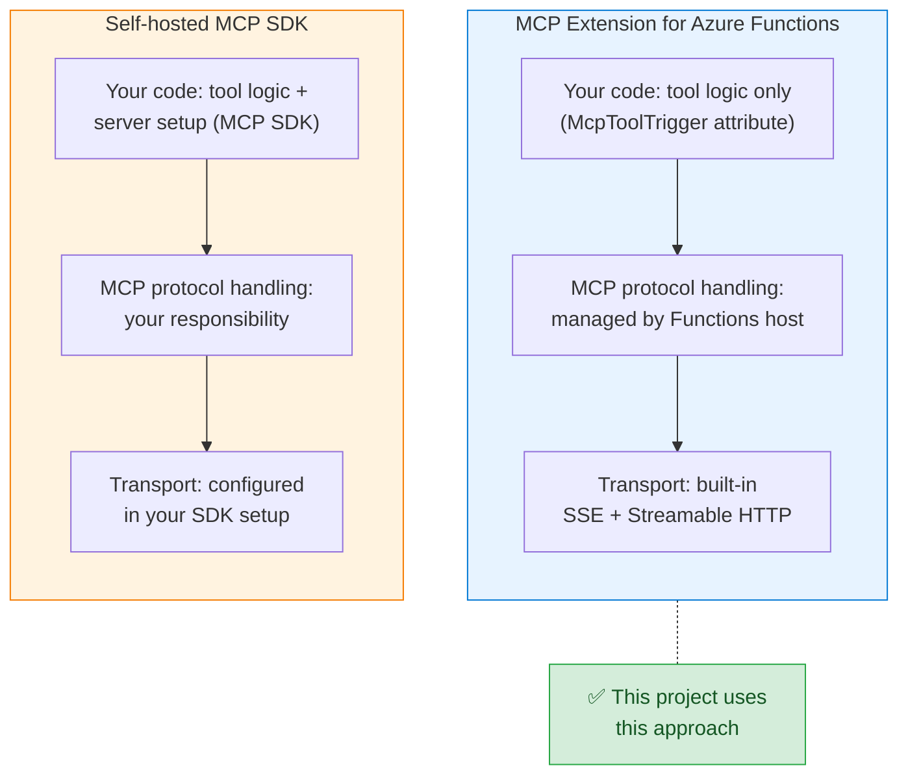
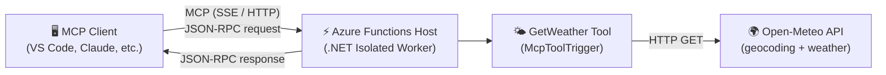
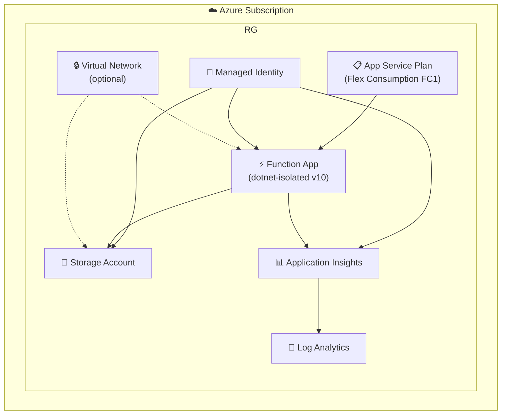

<!--
---
name: Remote MCP Weather Server using Azure Functions (.NET/C#)
description: A remote Model Context Protocol (MCP) server built with Azure Functions and .NET that provides real-time weather data via the Open-Meteo API. Clone, run locally with debugging, and deploy to the cloud with `azd up`.
page_type: sample
products:
- azure-functions
- azure
- mcp
urlFragment: remote-mcp-functions-dotnet-weather
languages:
- csharp
- bicep
- azdeveloper
---
-->

# Remote MCP Weather Server — Azure Functions (.NET)

[](https://codespaces.new/Azure-Samples/remote-mcp-functions)
[](https://vscode.dev/redirect?url=vscode://ms-vscode-remote.remote-containers/cloneInVolume?url=https://github.com/Azure-Samples/remote-mcp-functions)

A remote [Model Context Protocol (MCP)](https://modelcontextprotocol.io/) server built with **Azure Functions** and **.NET 10** that exposes a weather tool powered by the free [Open-Meteo API](https://open-meteo.com/). No API key is required.

Use this template to quickly build, debug, and deploy your own remote MCP server to Azure. The server is secured by design with HTTPS and function keys, and supports optional network isolation via VNET.

> **📚 Part of the Remote MCP Functions collection** — This project is one of the language-specific implementations from the [Azure-Samples/remote-mcp-functions](https://github.com/Azure-Samples/remote-mcp-functions?tab=readme-ov-file) repository, which provides quickstart templates for building remote MCP servers on Azure Functions across multiple languages (Python, TypeScript, C#, Java). Visit the [overview repo](https://github.com/Azure-Samples/remote-mcp-functions?tab=readme-ov-file) for the full catalog and additional resources.

## Background — Why Remote MCP on Azure Functions?

The [Model Context Protocol (MCP)](https://modelcontextprotocol.io/) enables AI assistants to securely call external tools and access data. While MCP servers are often run **locally** (via `stdio`), running them **remotely** unlocks key advantages:

- **Shared access** — A single deployed MCP server can serve multiple clients and users.
- **Server-side secrets** — API keys, database connections, and credentials stay on the server, never exposed to clients.
- **Centralized updates** — Update tool logic once; all connected clients get the change instantly.
- **Enterprise security** — Leverage Azure networking (VNET, Private Endpoints), managed identity, and API Management / Entra ID for authentication.
- **Scalability** — Azure Functions Flex Consumption plan scales to zero and up to 100 instances automatically.

The [remote-mcp-functions](https://github.com/Azure-Samples/remote-mcp-functions?tab=readme-ov-file) collection demonstrates how to build these remote servers using two approaches: the **MCP Extension for Azure Functions** and **self-hosted MCP SDK servers**. This project uses the **MCP Extension** approach.

## Solution Design — MCP Extension vs. MCP SDK

There are two distinct approaches to hosting MCP servers on Azure Functions. Understanding the trade-offs helps you choose the right one for your scenario.



### Comparison

| | **MCP Extension** (this project) | **MCP SDK (self-hosted)** |
|---|---|---|
| **Package** | [`Microsoft.Azure.Functions.Worker.Extensions.Mcp`](https://www.nuget.org/packages/Microsoft.Azure.Functions.Worker.Extensions.Mcp) | [`ModelContextProtocol`](https://www.nuget.org/packages/ModelContextProtocol) (official C# SDK) |
| **How you define tools** | Declarative — `[McpToolTrigger]` attribute on a function | Programmatic — register tools with the MCP SDK server builder |
| **Protocol handling** | Fully managed by the Azure Functions host | You configure and manage the MCP server lifecycle |
| **Transport** | Built-in SSE + Streamable HTTP at `/runtime/webhooks/mcp` | You set up transport (SSE, stdio, etc.) in code |
| **Lines of code** | Minimal — just write tool logic | More setup — server init, DI, transport config |
| **Flexibility** | Convention-based; great for standard tools | Full control over server behavior, middleware, resources |
| **Best for** | Rapid development, standard tool patterns, teams familiar with Azure Functions | Custom MCP features, complex server logic, non-Functions hosting |
| **Example repos** | [C#](https://github.com/Azure-Samples/remote-mcp-functions-dotnet) · [Python](https://github.com/Azure-Samples/remote-mcp-functions-python) · [TypeScript](https://github.com/Azure-Samples/remote-mcp-functions-typescript) · [Java](https://github.com/Azure-Samples/remote-mcp-functions-java) | [C#](https://github.com/Azure-Samples/mcp-sdk-functions-hosting-dotnet) · [Python](https://github.com/Azure-Samples/mcp-sdk-functions-hosting-python) · [TypeScript](https://github.com/Azure-Samples/mcp-sdk-functions-hosting-node) |

### Why this project uses the MCP Extension

This project uses the **MCP Extension** approach because:

1. **Minimal boilerplate** — A single `[McpToolTrigger]` attribute turns any function into an MCP tool. No server setup, transport config, or protocol plumbing needed.
2. **Native Functions experience** — Follows the same trigger/binding pattern as HTTP triggers, Timer triggers, etc. If you know Azure Functions, you already know how to build MCP tools.
3. **Production-ready infrastructure** — The extension manages sessions, transport negotiation, and the `/runtime/webhooks/mcp` endpoint automatically, so you can focus on tool logic.

## Features

- **MCP Tool — `GetWeather`**: Returns current weather conditions (temperature, humidity, wind, condition) for any city name or zip code.
- Built with the native [Azure Functions MCP extension](https://www.nuget.org/packages/Microsoft.Azure.Functions.Worker.Extensions.Mcp) (`McpToolTrigger`).
- Uses [Open-Meteo](https://open-meteo.com/) geocoding + weather APIs — **no API key needed**.
- Deployed on the **Azure Functions Flex Consumption** plan for cost-efficient, serverless scaling.
- Infrastructure as Code with **Bicep** and one-command deployment via **Azure Developer CLI** (`azd up`).
- Pre-configured VS Code MCP client config for local development.

## Architecture



### Azure Deployment



## Prerequisites

| Requirement | Install |
|---|---|
| .NET 10 SDK | [Download](https://dotnet.microsoft.com/download/dotnet/10.0) |
| Azure Functions Core Tools v4 | [Install](https://learn.microsoft.com/azure/azure-functions/functions-run-local) |
| Azure Developer CLI (`azd`) | [Install](https://learn.microsoft.com/azure/developer/azure-developer-cli/install-azd) (v1.23+) |
| Node.js (for Azurite) | [Download](https://nodejs.org/) |
| Azure subscription | [Free account](https://azure.microsoft.com/free/) |

## Project Structure

```
├── azure.yaml                       # Azure Developer CLI configuration
├── infra/                           # Bicep infrastructure-as-code
│   ├── main.bicep                   # Main deployment (subscription scope)
│   ├── main.parameters.json         # Deployment parameters
│   ├── abbreviations.json           # Resource naming abbreviations
│   └── app/
│       ├── api.bicep                # Function App (Flex Consumption)
│       ├── rbac.bicep               # Managed identity role assignments
│       ├── vnet.bicep               # Virtual network (optional)
│       └── storage-PrivateEndpoint.bicep
├── src/
│   ├── McpWeatherServer.csproj      # .NET project file
│   ├── Program.cs                   # Functions host entry point
│   ├── WeatherFunction.cs           # MCP tool definition
│   ├── WeatherService.cs            # Open-Meteo API client
│   ├── host.json                    # Functions host configuration
│   └── local.settings.json          # Local dev settings
└── .vscode/
    └── mcp.json                     # VS Code MCP client configuration
```

## Quickstart — Run Locally

1. **Install Azurite** (local storage emulator):

   ```bash
   npm install -g azurite
   ```

2. **Start Azurite** in a separate terminal:

   ```bash
   azurite --silent
   ```

3. **Start the Functions host**:

   ```bash
   cd src
   func start
   ```

4. The MCP server is now running at:

   | Transport | URL |
   |---|---|
   | SSE | `http://localhost:7071/runtime/webhooks/mcp/sse` |
   | Streamable HTTP | `http://localhost:7071/runtime/webhooks/mcp` |

5. **Connect from VS Code**: The `.vscode/mcp.json` is pre-configured — open Copilot Chat and ask something like _"What's the weather in Seattle?"_.

## Deploy to Azure

1. **Log in**:

   ```bash
   azd auth login
   ```

2. **Provision and deploy** (creates all resources and deploys code):

   ```bash
   azd up
   ```

   You'll be prompted for an environment name and Azure region. Deployment takes ~3–5 minutes.

3. **Get the deployed endpoint**:

   ```bash
   azd env get-values
   ```

   Look for `AZURE_FUNCTION_NAME` — your remote MCP endpoint will be:

   ```
   https://<AZURE_FUNCTION_NAME>.azurewebsites.net/runtime/webhooks/mcp
   ```

4. **Retrieve the function key** (required for remote access):

   ```bash
   az functionapp keys list -n <AZURE_FUNCTION_NAME> -g <RESOURCE_GROUP> --query "systemKeys.mcp_extension" -o tsv
   ```

   Append it as a query parameter: `?code=<KEY>`.

## Connect an MCP Client

### VS Code — Local

Already configured in `.vscode/mcp.json`. Just run `func start` and use Copilot Chat.

### VS Code — Remote (Azure)

Add a new entry to `.vscode/mcp.json`:

```json
{
  "servers": {
    "remote-mcp-weather": {
      "type": "http",
      "url": "https://<FUNCTION_APP>.azurewebsites.net/runtime/webhooks/mcp/sse?code=<MCP_EXTENSION_KEY>"
    }
  }
}
```

### Claude Desktop

Add to your `claude_desktop_config.json`:

```json
{
  "mcpServers": {
    "weather": {
      "type": "sse",
      "url": "https://<FUNCTION_APP>.azurewebsites.net/runtime/webhooks/mcp/sse?code=<MCP_EXTENSION_KEY>"
    }
  }
}
```

## MCP Tools

### `GetWeather`

Returns current weather conditions for a given location.

| Parameter | Type | Description |
|---|---|---|
| `location` | `string` | City name or zip code (e.g., `Seattle`, `94568`, `New York`) |

**Example response:**

```json
{
  "Location": "Dublin, California, United States",
  "Condition": "Clear sky",
  "TemperatureC": 16,
  "TemperatureF": 62,
  "HumidityPercent": 64,
  "WindKph": 22,
  "Wind": "22 km/h WNW",
  "ReportedAtUtc": "2026-03-05 05:15:00Z",
  "Source": "open-meteo"
}
```

## Azure Resources

When deployed with `azd up`, the following resources are created:

| Resource | Purpose |
|---|---|
| **Azure Functions** (Flex Consumption FC1) | Hosts the MCP server |
| **Storage Account** | Function app state and deployment packages |
| **Application Insights** | Monitoring and logging |
| **Log Analytics Workspace** | Centralized logs |
| **User-Assigned Managed Identity** | Secure access to storage and monitoring |
| **Virtual Network** (optional) | Network isolation with private endpoints |

## Cost

The Flex Consumption plan charges only for actual execution time. For development and low-traffic scenarios, costs are minimal. See [Azure Functions pricing](https://azure.microsoft.com/pricing/details/functions/) for details.

## Clean Up

To remove all Azure resources:

```bash
azd down
```

## Contributing

See [CONTRIBUTING.md](CONTRIBUTING.md) for guidelines.

## License

This project is licensed under the MIT License — see [LICENSE.md](LICENSE.md).
